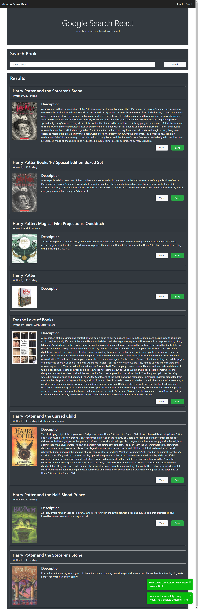
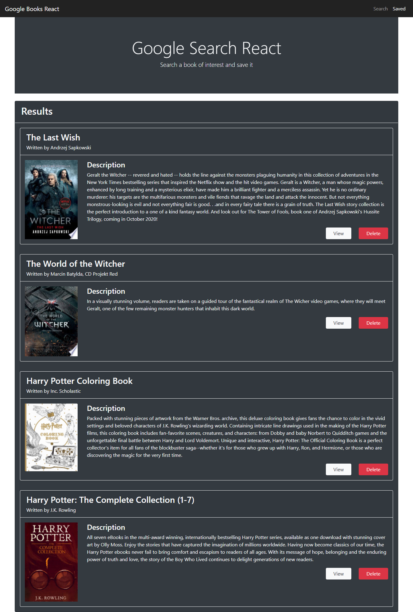

# Google Books React

## 

## Table of Contents

- [Description](#Description)
- [Installation Instructions](#Installation-Instructions)
- [Usage Information](#Usage-Information)
- [Contribution Guidelines](#Contribution-Guidelines)
- [Test Instructions](#Test-Instructions)
- [GitHub Page](#GitHub-Page)
- [Questions](#Questions)

## Description

This is an app coded with React that allows users to search for books on the Google Books API. Users can click on links to be brought to an info page of the book, save the target book, and remove books from the saved list.

This is a single-page app, and React-Router-Dom is used to conditionally render one of the two pages. Bootstrap v4.6 is used as the CSS framework. React-Toastify is used to make the toast popups.

This app is deployed on GitHub and is available at the following link:

https://google-books-react-olioli.herokuapp.com/

## Installation Instructions

```
N/A
```

## Usage Information

Upon reaching the home page, the user will see the front page with a search box. When the user types in the search box and click "Search", a list of ten books will be fetched from the API to be displayed as the results. Each book will display a title, cover image, authors, and a brief description. A "View" button will be available; when clicked, it brings the user to the info page of the book. Another "Save" button will be present as well; when clicked, the user will store that particular book in the database. When the book is saved, it is removed from the result list. If the save is successful, a toast will pop up to notify the user.

Upon reaching the saved books page, the user will see the previous list of books saved by them. The user will have the same "View" button to bring them to the info pages. Also, there is a "Delete" button should the user choose to remove a saved book. When successfully deleted, a toast will pop up to notify the user.

## Sample Page

### Search Page with Search Results



### Saved page with Saved Results



## Contribution Guidelines

```
N/A
```

## Test Instructions

```
N/A
```

## GitHub Page

https://github.com/runescape11111/google-books-react

## Questions

GitHub profile: github.com/runescape11111/

Email: olivershih@gmail.com
